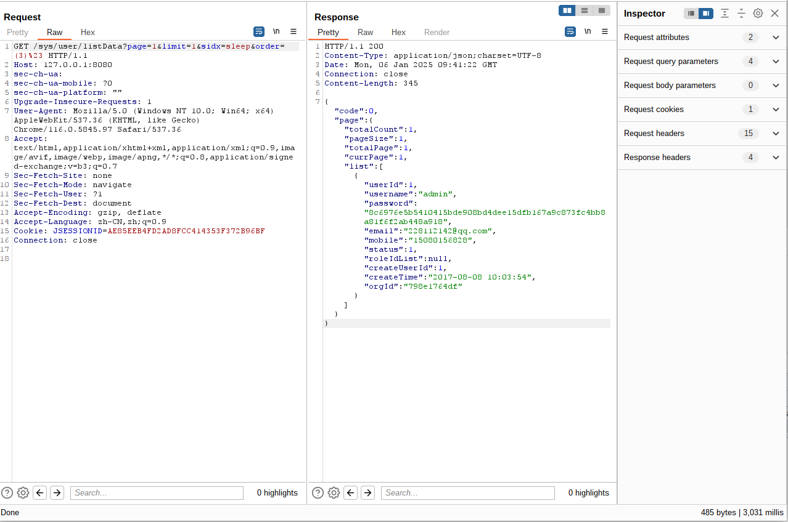

### BUG_Author:

Wu Wenhao with StarMap Team of Legendsec at QI-ANXIN Group

Yin Lingyun with StarMap Team of Legendsec at QI-ANXIN Group

### Affected version:

cy-fast

### Vendor:

cy-fast

### Software:

https://gitee.com/leiyuxi/cy-fast

### Vulnerability File:

SysUserController.java

### Description:

The current version of cy-fast has an SQL injection vulnerability that allows attackers to execute SQL statements.
Due to the lack of comprehensive filtering of SQL statements, users can concatenate and execute unfiltered SQL functions.


Severity: High


The issue lies in the route `/sys/user/listData`. Due to insufficient filtering, SQL functions can be executed through concatenation.

Corresponding critical code for handling the issue.

```
	@ResponseBody
	@RequestMapping("/listData")
	@RequiresPermissions("sys:user:list")
	public R listData(@RequestParam Map<String, Object> params){
		//只有超级管理员，才能查看所有管理员列表
		if(getUserId() != Constant.SUPER_ADMIN){
			params.put("createUserId", getUserId());
		}

		//查询列表数据
		Query query = new Query(params);
		List<SysUser> userList = sysUserService.queryList(query);
		int total = sysUserService.queryTotal(query);

		PageUtils pageUtil = new PageUtils(userList, total, query.getLimit(), query.getPage());

		return R.ok().put("page", pageUtil);
	}
```

```
<when test="sidx != null and sidx.trim() != ''">
    order by ${sidx} ${order}
</when>
```


final poc:

